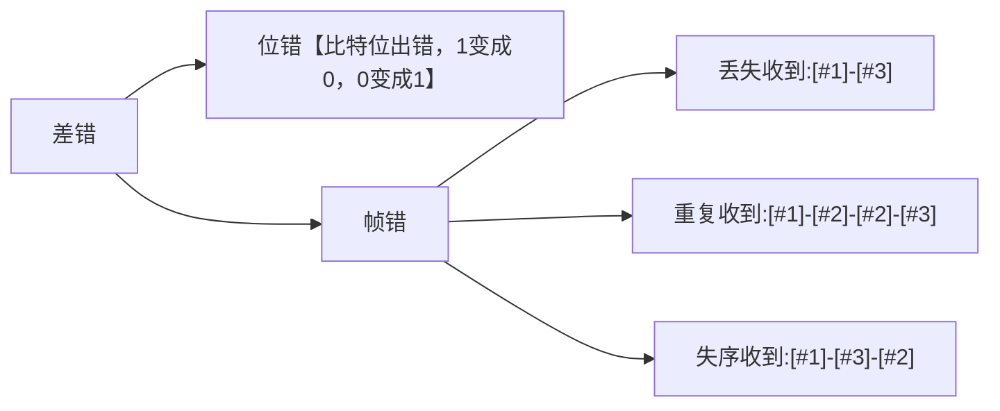
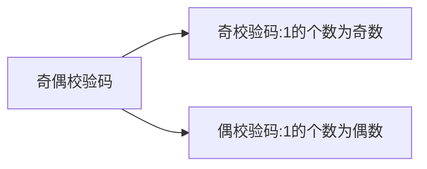
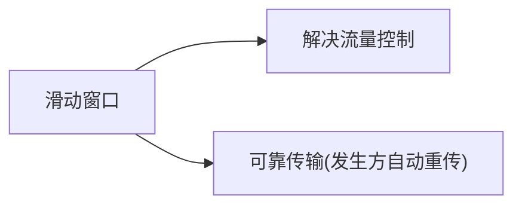

# 功能概述

## 名词解释

结点：主机、路由器  

链路：网络中两个结点之间物理通道，链路的传输介质主要有双绞线、光纤、微波。分为有线、无线。  

数据链路： 网络中两个结点之间的逻辑通道，把实现控制数据传输协议的软硬件加到链路上构成数据链路。  

帧：链路层的协议数据单元，封装网络层数据报。

## 功能

- 为网络层提供服务，无确认无连接服务，有确认无连接服务，有确认面向连接服务。
- 链路管理，用于面向连接的服务
- 组帧
- 流量控制
- 差错控制

# 封装成帧 & 透明传输

## 封装成帧

在一段数据的前后部分添加头部和尾部，构成一个帧，首尾部包含许多控制信息，他们还有一个重要信息：**帧定界**

帧同步： 接收方应当能从接收到的二进制比特流中区分起始和终止。

组帧的四种方法：字符计数法、字符填充法、零比特填充法、违规编码法

透明传输：
所传数据的比特组合和控制信息一致，必须采取适当措施，使收方不会将数据误认为是控制信息，这样就保证了数据链路层的传输是透明的。

### 字符计数法

帧首部使用第一个字节来表明帧内字符数
（易出错）

### 字符填充法

首尾部各加一个起始终止符，在数据中有终止起始符，在终止起始前加转义字符。

### 零比特填充法

首尾加边界位01111110

1. 发送端，扫描整个字段，只要有连续五个1，就填入一个0；
2. 在接收端收到一个帧，先找标志位确定边界，扫描，发现五个连续1，删除后面一个0；
保证了透明传输，在传输的比特流中可以传输任意比特组合，不会引起边界判断错误。

### 违规编码法

曼彻斯特编码：高低为0，低高为1，
违规编码：高高低低作为帧的起始和终止

# 差错控制（检错编码）

差错从何而来：噪声。
对于随机热噪声，提高信噪比
对于冲击噪声，差错控制的对象。

- 无确认无连接服务（通信质量好，有线传输链路） 
- 有确认有连接或有确认面向连接服务（通信质量差的无线传输链路）

## 检错编码

### 奇偶校验码

n-1位信息元
1位检验元

特点：
检错能力50%。

### CRC循环冗余码

#### 发送端

1. 准备待发送有效数据分成组
2. 每个组都加上冗余码构成帧再发送
   d位 + r位FCS
   双方商定的除数/生成多项式（r+1位）
   对FCS帧计算方式
   d位 + r位0 /生成多项式 = 商 。。。r位FCS
3. 校验

#### 例子

发送的数据1101 0110 11，采用CRC校验，生成多项式10011，最终发送的数据？

最终发送数据 = 发送的有效数据 + FCS  

计算冗余码：

1. 加0（假设生成多项式G(x)的阶为r，则加r个0）
2. 模2除法

10011表示成多项式为：$x^4+x^1+x^0$,阶为4;

#### 接收端检错

把收到的每个帧都除以同样的除数，然后检查得到的余数R

1. 余数为0，无差错接受 
2. 余数不为0，有差错丢弃

特点：
概率接近于1的传输
无差错的比特传输，不是可靠传输。

## 纠错编码

### 海明码

海明距离：
两个合法编码对应比特取值不同的比特数称为两个码字的海明距离。一个有效编码集中，任意两个合法码字的海明距离的最小值称为编码集的海明距离。

结论：
一个编码集，若具有检错d位错误，则码距为d+1；若具有d位纠错能力，则码距为2d+1;

#### 确认校验码位数r

D = 1100
数据m位，冗余码r位，则$2^r>=m+r+1$
m = 4
满足不等式的$r_{min}=3$
所以校验码3位

#### 确定检验码和数据的位置

D=1100
校验码放在序号为$2^n$的位置上，数据按序填上
|序号|7|6|5|4|3|2|1|
|---|--|--|--|--|--|--|--|
|值|1|1|0|$x_4$|0|$x_2$|$x_1$|

#### 求出校验码的值

D=1100

|二进制|111|110|101|100|011|010|001|
|---|--|--|--|--|--|--|--|
|序号|7|6|5|4|3|2|1|
|值|1|1|0|$x_4$|0|$x_2$|$x_1$|

校验码负责各自位数为1对应的数
例如 $x_4$二进制位100，则对应1**的二进制，也就是7，6，5，4；
$x_4$ 负责4、5、6、7的校验
$x_2$ 负责2、3、6、7的校验
$x_1$ 负责1、3、5、7的校验

采用偶校验，使得各自曾为偶校验
$x_4=0$
$x_2=0$
$x_1=1$
发送数据:1100001;

#### 检错并纠错

假如接收的数据D=1110001
|二进制|111|110|101|100|011|010|001|
|---|--|--|--|--|--|--|--|
|序号|7|6|5|4|3|2|1|
|值|1|1|1|0|0|0|1|

4567的校验0111 偶校验出错
2367的校验0011 偶校验正确
1357的校验1011 偶校验出错

纠错方法一：
找到不满足奇/偶校验的分组取交集，与符合奇/偶的分组取差集。
4567∩1357 = 57 - 2367=5 第五位出错

纠错方法二：

$x_4$ 与0111 满足偶校验的话$x_4=1$
$x_2$ 与0011 满足偶校验的话$x_2=0$
$x_1$ 与1011 满足偶校验的话$x_1=1$

$x_4x_2x_1=101$ 转十进制为5，则第五位出错。

# 流量控制 & 可靠传输机制

## 流量控制

数据链路层流量控制手段（点对点）：接收方收不下就不回复
传输层流量控制（端对端）： 接收端给发送端一个窗口公告

### 流量控制方法

- 停止等待协议
   每发送完一个帧就停止发送，等待对方确认，收到确认发送下一个帧，发送窗口=1，接收窗口=1
- 滑动窗口协议
   1. 后退N帧协议（GBN）发送窗口>1,接收窗口=1
   2. 选择重传协议（SR）发送窗口>1,接收窗口>1;

### 停止-等待协议

1. 为什么会有停止-等待协议？
   除了比特差错，底层信道还会丢包，为了实现流量控制
2. 研究该协议的前提？
   半双工协议
3. 应用情况？
   无差错
   有差错
   （超时计时器，设置重传时间>平均RTT）的情况。
   
   
   
   信道利用率：
   发送方在一个发送周期内，有效发送数据所需时间占整个发送周期的比率。
   信道利用率 = （L/C）/T；
   L:时间T发送的L比特数据
   C：发送方数据传输率
   T:发送周期

   信道吞掉率 = 信道利用率+发送方的发送速率

   缺点：信道利用率低。

流水线技术：1.必须增加序号范围 2.发送方需缓存多个分组

### 滑动窗口

#### 后退N帧协议

发送窗口：发生方维持一组连续的允许发送帧的序号

接收窗口： 接收方维持一组连续的允许接收帧的序号。

- 发送方做的事情：
  1. 上层的调用：上层需要发送数据时，发送方检查发送窗口是否已满，如果未满，产生一个帧发送，如果已满，数据返回给上层，暗示等会发送（实际上，窗口满会放在缓存中）
  2. 收到ACK： 对n号帧的确认采用**累计确认**的方式，表明接收方已经收到n号帧和它之前的全部帧。
  3. 超时事件：出现丢失和时延过长，重发所以已发生未确认帧。

- 接收方做的事情：
  1. 如果正确收到n号帧，接收方为n帧发送一个ACK,将数据交给上层
  2. 只接受期待的帧，其余都丢弃，为最近按序接收的帧重发ACK;

窗口长度：
若采用n个比特对帧，发送窗口尺寸$1<=W_T<=2^n-1$,否则无法区分新帧旧帧

缺点：
批量重传

#### 选择重传协议

